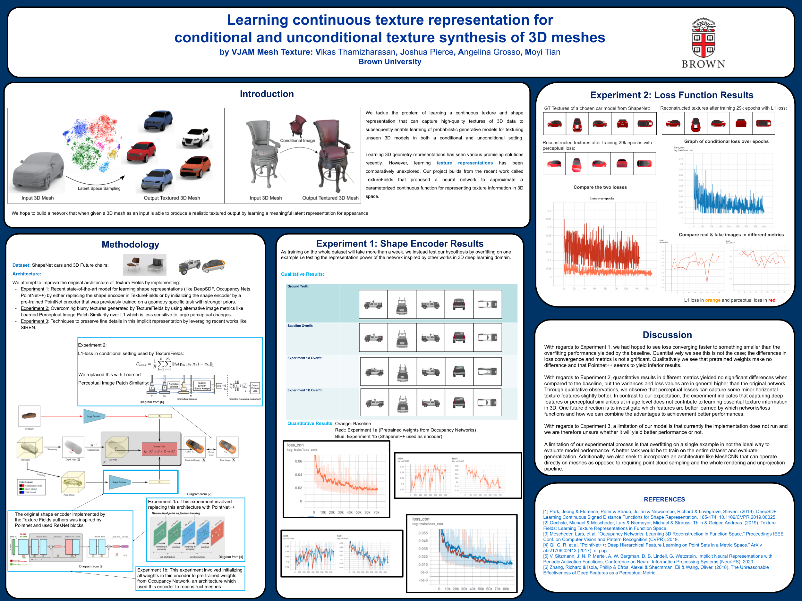
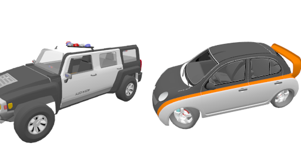

# DeepTexture
Learning texture representations: Learn high quality textures of 3D data to enable learning of probabilistic generative models for texturing unseen 3D models.

<div style="text-align: center">

</div>

This repository contains updated code for the paper 'Texture Fields: Learning Texture Representations in Function Space'.

## Installation
The simplest way to run our implementation is to use [anaconda](https://www.anaconda.com/). 

You can create an anaconda environment called `texturefields` with
```
git clone https://github.com/autonomousvision/texture_fields
cd texture_fields
# copy our modifications
git clone https://github.com/vikasTmz/DeepTexture.git
cp DeepTexture/mesh2tex/* mesh2tex/
cp DeepTexture/mesh2tex/geometry/* mesh2tex/geometry/

conda env create -f environment.yaml
conda activate texturefields
```


## Dataset

### ShapeNet

<div style="text-align: center">

</div>

For downloading the preprocessed data, run the following script. 
```
source ./scripts/download_data.sh
```
We just provide data for the car category with a file size of 33 GB.
The dataset is copied to the `data/` folder. For each 3D object we have 17 input views, 10 random views with corresponding depth maps and camera information. The train, test and validation splits are located in the main sub folder of the categories. For visualization, we provide renderings from fixed views in th `visualize` subfolder.
Data structure:
____
data/shapenet/data_cars/{ModelID}/\
&nbsp;&nbsp;&nbsp;&nbsp; input_image/ \
&nbsp;&nbsp;&nbsp;&nbsp; image/\
&nbsp;&nbsp;&nbsp;&nbsp; depth/\
&nbsp;&nbsp;&nbsp;&nbsp; visualize/\
&nbsp;&nbsp;&nbsp;&nbsp;&nbsp;&nbsp;&nbsp;&nbsp; image/\
&nbsp;&nbsp;&nbsp;&nbsp;&nbsp;&nbsp;&nbsp;&nbsp; depth/\
&nbsp;&nbsp;&nbsp;&nbsp; pointcloud.npz
____

### 3D FUTURE

<div style="text-align: center">

</div>

3D Future can be downloaded from here: https://tianchi.aliyun.com/specials/promotion/alibaba-3d-future.
Because of the license it cannot be distributed openly. We can provide on request (there is a copy located in Brown Visual Computing machine).

### Preprocessing 3D FUTURE

The code to preprocess 3d future to shapenet's specifications is provided in utils.

1. Open the data_generattion.blend file in Blender (version 2.90)
2. Load the ` blender_camera_intrinsics.py` file and run it. Alternatively, you can copy paste the content into Blender's python console.
3. The output should be 10 depth maps in .exr format and rendered images from various view points, the camera intrinsic and extrinsic for these view points will be stored in .npz file.

**Sampling Point clouds and surface normals from input mesh**:

```
cd utils/sample_points
xvfb-run -a -s "-screen 0 800x600x24" meshlabserver -i model.obj -o model.xyz -s upsample.mlx # run this command, need meshlab server installed
python 2_generate_normal.py
# Output should be pointcloud.npz file with points and normals
```

## Usage

### Training
For training a model from scratch run 
```
python train.py configs/singleview/texfields/car.yaml
# Change the path to dataset accordingly
```
in the conda environement.
Please set the following option in the config file:
```
model:
  model_url:
```
So that pre-trained model are not loaded.
The training process can be visualized with tensorboard. The logfiles are saved to the `logs` folder in the output directory.
```
tensorboard --logdir ./out --port 6006
```----


    @inproceedings{OechsleICCV2019,
        title = {Texture Fields: Learning Texture Representations in Function Space},
        author = {Oechsle, Michael and Mescheder,Lars and Niemeyer, Michael and Strauss, Thilo and Geiger, Andreas},
        booktitle = {Proceedings IEEE International Conf. on Computer Vision (ICCV)},
        year = {2019}
    }
